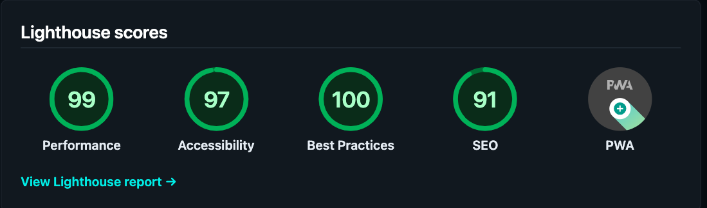

# My 2025 Website Update: Contentful-Powered Gatsby Site



## Project Overview

This project is a Gatsby site that integrates Contentful as its content management system (CMS).

### Key Features

- **Gatsby Integration with Contentful**: Gatsby is used as the frontend, while Contentful serves as the CMS. This combination provides an efficient static site generator that pulls content from Contentful.
- **Combining Content Types**: The script ensures that existing content types are not overwritten, merging new content types with the ones already in place.

### Tech Stack

- **Gatsby**: Static site generator for React-based web applications.
- **Contentful**: Headless CMS for managing content.
- **Styling:** Styled Components, CSS, and Theme UI
- **Hosting/Deployment:** Netlify, Cloudflare
- **Node.js**: For executing server-side scripts and managing the setup process.

### Abstract Interfaces for GraphQL Schema Customization

This project uses **abstract interfaces** in GraphQL to define a flexible and reusable schema for integrating Contentful data. Interfaces serve as shared contracts for related types, ensuring consistency and simplicity in querying CMS data.

#### **Overview:**

1. **What are Interfaces?**
   Interfaces define common fields and structure that other types must implement, enabling reusable and flexible schema definitions.

   Example:

   ```graphql
   interface HomepageBlock implements Node {
     id: ID!
     blocktype: String
   }
   ```

2. **Implementation by Types:**
   Concrete types like `ContentfulHomepageHero` or `ContentfulHomepageFeature` implement these interfaces to conform to their structure.

   Example:

   ```graphql
   type ContentfulHomepageHero implements Node & HomepageBlock {
     id: ID!
     blocktype: String @blocktype
     heading: String!
     image: HomepageImage @link(from: "image___NODE")
     text: String
   }
   ```

3. **Simplified Queries:**
   Interfaces enable querying shared fields across all implementations, reducing complexity.

   Example Query:

   ```graphql
   {
     allHomepageBlock {
       nodes {
         id
         blocktype
       }
     }
   }
   ```

#### **Benefits:**

- **Consistency:** Ensures a unified structure across multiple types.
- **Flexibility:** Enables queries at both abstract and specific levels.
- **Reusability:** Shared definitions simplify schema management.
- **Efficient CMS Integration:** Bridges Contentful’s data with GraphQL for easier querying and maintenance.

#### **Use Case in This Project:**

- **Homepage Blocks:** Define blocks (e.g., hero, features) using `HomepageBlock` and its concrete implementations.
- **Rich Text Fields:** Use custom field extensions (e.g., `richText`) for processing Contentful's raw data into HTML.
- **Dynamic Image Handling:** Utilize field extensions for managing Contentful assets with `gatsby-plugin-image`.

This approach creates a scalable, maintainable schema for managing CMS content within the GraphQL API.

## Setup and Installation

### Prerequisites

To set up and run this project, you will need:

- **Node.js** and **npm/yarn** installed.
- A **Contentful Space ID** and **API tokens**.

### Step-by-Step Setup

1. **Clone the Repository**

   ```bash
   git clone <repository-url>
   cd <project-directory>
   ```

2. **Install Dependencies**

   ```bash
   npm install --legacy-peer-deps
   # or
   yarn install
   ```

3. **Run Setup Script to Configure Contentful**
   The script provided will help populate the Contentful space and set up the content types required:

   ```bash
   node scripts/setup.js
   ```

   During the setup, you will be prompted to enter:
   - **Contentful Space ID**
   - **Content Delivery API Access Token**
   - **Content Management API Access Token**

   Alternatively, you can provide these values as environment variables:

   ```bash
   CONTENTFUL_SPACE_ID=your_space_id CONTENTFUL_ACCESS_TOKEN=your_delivery_token CONTENTFUL_MANAGEMENT_TOKEN=your_management_token node scripts/setup.js
   ```

### Configuring Environment Variables

After running the setup script, two environment configuration files will be generated:

- **.env.development**
- **.env.production**

These files contain the necessary environment variables to connect your Gatsby project with Contentful. Make sure you **do not commit** these files to version control.

Example of `.env.development`:

```env
CONTENTFUL_SPACE_ID='your_space_id'
CONTENTFUL_ACCESS_TOKEN='your_access_token'
# To enable previews locally, uncomment the next line:
# CONTENTFUL_HOST='preview.contentful.com'
```

## Deployment Status

[](https://app.netlify.com/sites/gilbertaharocode/deploys)
