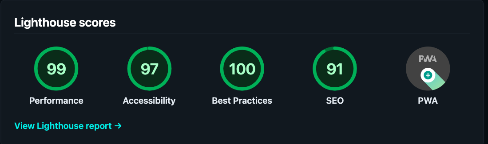
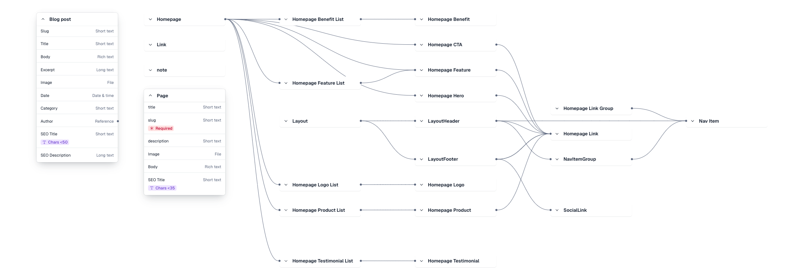

# My 2025 Website Update: Contentful-Powered Gatsby Site V2.0
>
> **Last Updated**: January 30, 2025





[](https://app.netlify.com/sites/gilbertaharocode/deploys)

## Project Overview

This repository contains a **Gatsby** website integrated with **Contentful** for content management and a newly introduced **Blog Post** system. By leveraging **GraphQL** queries and Contentful’s flexible data model, the site can fetch and render content for **Pages**, **Blog Posts**, and modular homepage blocks (e.g., Hero, Feature, CTA, etc.).

## Key Features

- **Blog Post Content Type**: Manage blog articles (title, slug, excerpt, body, image, category, date, etc.) directly from Contentful.
- **Modular Homepage Blocks**: Use a variety of content types (Hero, Feature, CTA, etc.) for flexible, reusable homepage sections.
- **SEO-Friendly**: Includes separate fields for SEO Title and SEO Description in both Page and Blog Post content types, plus a custom `<SEOHead>` component for meta tags.
- **Dynamic Routing**: Gatsby’s `createPages` API in `gatsby-node.js` generates individual blog pages and category-based archives automatically.
- **Responsive, Accessible UI**: Styles built with **Vanilla Extract** for consistent design tokens and fluid responsiveness.

## Core Technologies

- **Gatsby**: React-based static site generator for high performance and speed.
- **Contentful**: Headless CMS to store and deliver structured content.
- **GraphQL**: Query language for pulling data from Contentful.
- **Vanilla Extract**: CSS-in-JS approach for theming and design tokens.
- **Netlify**: Hosting and continuous deployment (see `netlify.toml`).
- **Node.js**: For local development scripts and Gatsby build process.

---

## Contentful Model Overview

### 1. **Blog Post**

**Fields**:

- **Slug** *(Short text, required)*  
- **Title** *(Short text, required)*  
- **Body** *(Rich text)*  
- **Excerpt** *(Long text)*  
- **Image** *(File)*  
- **Date** *(Date & time)*  
- **Category** *(Short text)*  
- **Author** *(Reference to an Author or text)*  
- **SEO Title** *(Short text, < 50 chars)*  
- **SEO Description** *(Long text)*

> **Note**: The `slug` is used to generate the page URL (e.g. `/blogs/{slug}`). GraphQL queries in `gatsby-node.js` or `blog-post.js` fetch data for each post.

### 2. **Page**

**Fields**:

- **title** *(Short text)*  
- **slug** *(Short text, required)*  
- **description** *(Short text)*  
- **Image** *(File)*  
- **Body** *(Rich text)*  
- **SEO Title** *(Short text, <35 chars)*  
- **SEO Description** *(Long text)*

> **Note**: Typically used for top-level site pages with custom content.

### 3. **Layout & Homepage Blocks**

These content types (e.g., Homepage Hero, Feature List, CTA, LayoutHeader, LayoutFooter, etc.) are stored in Contentful and retrieved for the homepage and global site layout. They share common fields via GraphQL **interfaces**.

---

## Developer Documentation

1. **Setup**  
   - Copy `.env.EXAMPLE` → `.env.development` & `.env.production`, fill in **Contentful** credentials:

     ```env
     CONTENTFUL_SPACE_ID=xxxx
     CONTENTFUL_ACCESS_TOKEN=xxxx
     CONTENTFUL_MANAGEMENT_TOKEN=xxxx
     ```

   - Install dependencies:  

     ```bash
     npm install
     # or
     yarn install
     ```

2. **Local Development**  
   - Run `npm run develop` or `yarn develop`.
   - Open `http://localhost:8000` to see the site locally.  
   - Use `gatsby-source-contentful` for fetching data. Check `gatsby-config.mjs` for plugin options.

3. **Creating Blog Post Pages**  
   - In `gatsby-node.js`, we query all blog post slugs and create individual pages at build time, using the `blog-post.js` template.  
   - For category listings, `blog-category.js` can filter posts by a `category` field.

4. **SEO & `<SEOHead>`**  
   - Use `src/components/head.js` to inject meta tags on each page or post.  
   - Pass `title`, `description`, and optional `image` or `url` props.

---

## Full Folder Structure (with Comments)

```bash
└── gah-code-gilbertoharosite/      # Root of the project
    ├── README.md                  # Project readme (this file)
    ├── LICENSE                    # License info (BSD 0-Clause)
    ├── gatsby-browser.js          # Gatsby browser-level APIs (fonts, global styles)
    ├── gatsby-config.mjs          # Main Gatsby config, includes plugins
    ├── gatsby-node.js             # Gatsby Node APIs for dynamic page creation
    ├── netlify.toml               # Netlify configuration for deployment
    ├── package.json               # NPM/Yarn dependencies and scripts
    ├── .env.EXAMPLE               # Example env variables for Contentful
    ├── .nvmrc                     # Node version specification
    ├── .prettierignore            # Prettier ignore rules
    ├── .prettierrc.json           # Prettier configuration
    └── src/                       # Source code for the Gatsby site
        ├── components/
        │   ├── UILibraryShowcase.js   # Demonstrates various UI components
        │   ├── fallback.js            # Fallback component for unknown block types
        │   ├── head.js                # SEOHead component for meta tags
        │   ├── sections.js           # Exports homepage sections (Hero, CTA, etc.)
        │   ├── design-system/         # Vanilla Extract theming + base styles
        │   │   ├── 404.css.ts
        │   │   ├── colors.css.ts
        │   │   ├── styles.css.ts
        │   │   └── theme.css.ts
        │   ├── layout/
        │   │   ├── footer.js          # Global footer
        │   │   ├── hero.js            # Example Hero layout or section
        │   │   ├── layout.js          # Wraps each page with header/footer
        │   │   ├── header/
        │   │   │   ├── header.css.ts
        │   │   │   └── header.js
        │   │   └── navigation/
        │   │       ├── nav-item-group.css.ts
        │   │       └── nav-item-group.js
        │   ├── post/                  # Blog post-specific components
        │   │   ├── PostCard.js
        │   │   └── PostCards.js
        │   ├── segments/              # Reusable sectional blocks (about, feature, etc.)
        │   │   ├── about/
        │   │   │   ├── about-hero.css.ts
        │   │   │   ├── about-hero.js
        │   │   │   ├── about-leadership.js
        │   │   │   ├── about-logo-list.js
        │   │   │   ├── about-stat-list.css.ts
        │   │   │   ├── about-stat-list.js
        │   │   │   ├── resume-styled-cert-list.css.ts
        │   │   │   ├── resume-styled-cert-list.js
        │   │   │   └── skill-list-grid.js
        │   │   ├── cv/
        │   │   │   ├── CertificateList.js
        │   │   │   └── ProjectList.js
        │   │   └── feature/
        │   │       ├── feature-list.js
        │   │       └── feature.js
        │   └── ui/                    # Generic UI building blocks (buttons, lists, etc.)
        │       ├── benefit-list.js
        │       ├── brand-logo.js
        │       ├── caret.css.ts
        │       ├── caret.js
        │       ├── chevron-right.js
        │       ├── cta.js
        │       ├── logo-list.js
        │       ├── product-list.js
        │       ├── stat-list.js
        │       ├── testimonial-list.js
        │       ├── ui.css.ts
        │       └── ui.js
        ├── pages/
        │   ├── 404.js                 # Custom 404 page
        │   ├── experience.js          # Sample experience page
        │   ├── index.js               # Homepage
        │   ├── learning.js            # Another top-level page
        │   └── {Page.slug}.js         # Dynamically created from Contentful's "Page" type
        └── templates/                 # Templates for dynamic page creation
            ├── blog-category.js       # Lists posts under specific categories
            ├── blog-index.js          # Main blog listing or "index" page
            ├── blog-post.css.ts       # Styling for single blog posts
            └── blog-post.js           # Template for rendering each Blog post

```

---

## Local Development & Deployment

1. **Clone & Install**  

   ```bash
   git clone <repo-url>
   cd gah-code-gilbertoharosite
   npm install
   # or
   yarn install
   ```

2. **Environment Variables**  
   - Copy `.env.EXAMPLE` → `.env.development` / `.env.production`
   - Provide **Contentful** credentials.

3. **Develop**  

   ```bash
   npm run develop
   ```

   or

   ```bash
   yarn develop
   ```

   Go to `http://localhost:8000`.

4. **Build & Serve**  

   ```bash
   npm run build && npm run serve
   ```

   or

   ```bash
   yarn build && yarn serve
   ```

5. **Deploy**  
   - **Netlify**: This project includes `netlify.toml` for config.  
   - Other hosts: Serve the `public/` folder after `gatsby build`.

---

## License

This project is licensed under **BSD Zero Clause License (0BSD)**. See [LICENSE](./LICENSE) for details.

---

### Project Cleanup and Optimization To-Do List

---

#### **General Cleanup**

- [ ] **Audit Dependencies**
  - [ ] Remove unused dependencies in `package.json`.
  - [X] Update outdated dependencies (`npm outdated`).
- [ ] **Review Environment Variables**
  - [X] Ensure `.env.EXAMPLE` reflects all required environment variables.
  - [X] Add `.env` to `.gitignore` to prevent sensitive data leaks.
- [ ] **Code Cleanup**
  - [ ] Remove unused components and files.
  - [X] Delete commented-out or dead code.
- [ ] **Organize Folder Structure**
  - [X] Consolidate redundant folders (e.g., `/post/` and `/templates/`).
  - [X] Consolidate Card with Compound pattern

  ### ✅ **Component Refactoring**

- ✅ **Refactor `BlogIndex` Component**
  - ✅ Extract `BlogList` component.
  - ✅ Extract `BlogItem` component.

---

#### **Performance Optimizations**

- [ ] **Image Optimization**
  - [ ] Ensure all images use `gatsby-plugin-image`.
  - [ ] Replace large static images with Contentful-hosted versions.
- [ ] **Lazy Loading**
  - [ ] Add lazy loading for non-critical components.
- [ ] **Build Performance**
  - [ ] Add `gatsby-plugin-preload-fonts`.
  - [ ] Optimize `gatsby-plugin-sharp` for images.
  - [ ] Use `gatsby-plugin-webpack-bundle-analyser-v2` to identify large bundles.
- [ ] **Contentful Query Optimizations**
  - [ ] Fetch only necessary fields in GraphQL queries.

---

#### **SEO & Accessibility Improvements**

- [ ] **SEO Metadata**
  - [ ] Add `<SEOHead>` for all pages.
  - [ ] Set default fallback metadata in `gatsby-config.mjs`.
- [ ] **Accessibility (A11y)**
  - [ ] Test with Lighthouse for accessibility improvements.
  - [ ] Use semantic HTML (e.g., replace `<div>` with `<button>` where appropriate).
- [ ] **Structured Data**
  - [ ] Add schema markup for blog posts (author, date, category).

---

#### **Design System & Styling**

- [ ] **Vanilla Extract Tokens**
  - [ ] Audit unused/redundant style tokens.
  - [ ] Ensure tokens are consistently used across components.
- [ ] **Global Stylesheet**
  - [ ] Add a `base.css.ts` for global resets and typography.

---

#### **Dynamic Content & Routing**

- [ ] **Dynamic Blog Pages**
  - [X] Verify blog posts and category pages are generated correctly.
  - [ ] Add 404 handling for invalid slugs.
- [ ] **Pagination**
  - [ ] Add pagination for `/blog` and category pages.
- [ ] **Search Functionality**
  - [ ] Implement search or filtering for blog posts.

---

#### **Developer Experience**

- [ ] **Linting & Formatting**
  - [X] Ensure `.prettierrc.json` and `.prettierignore` are properly configured.
    - [✅] Enable ESLint Rules for Unused Imports & Modules
  - [X] Add or configure `eslint` for consistent linting base set up.
- [ ] **TypeScript Migration**
  - [ ] Migrate components to TypeScript.
  - [ ] Add `gatsby-plugin-typescript`.
- [ ] **Testing**
  - [ ] Add unit tests for reusable components (e.g., `PostCard.js`).
  - [ ] Add end-to-end tests using Cypress.

---

#### **Deployment & Monitoring**

- [ ] **Netlify Configuration**
  - [ ] Optimize `netlify.toml` for redirects and caching.
  - [ ] Enable Netlify analytics.
- [ ] **CI/CD Integration**
  - [ ] Set up GitHub Actions or Netlify hooks for automated deployments.
- [ ] **Error Tracking**
  - [ ] Integrate Sentry for error reporting and monitoring.

---

#### **Future Enhancements**

- [ ] **Contentful Webhooks**
  - [ ] Trigger Gatsby builds on content changes.
- [ ] **Offline Support**
  - [ ] Add `gatsby-plugin-offline` for PWA capabilities.
- [ ] **Dark Mode**
  - [ ] Add dark mode support to Vanilla Extract tokens.
- [ ] **Analytics**
  - [ ] Add Google Analytics, Plausible, or PostHog for user behavior tracking.

---
